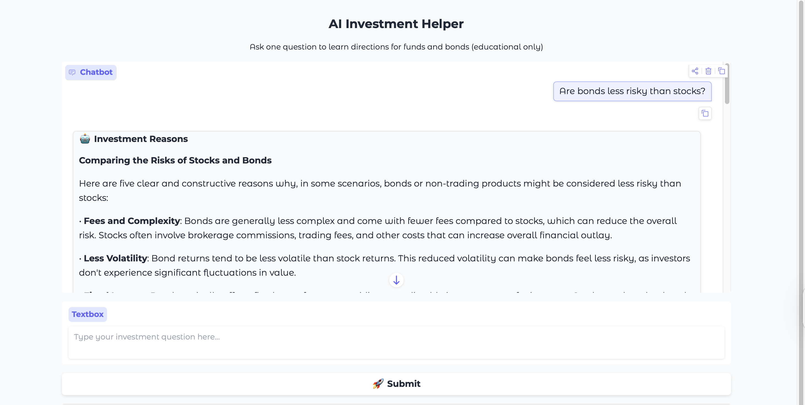
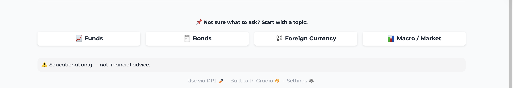

# 🤖 AI Investment Helper



An educational AI-powered web app that helps absolute beginners understand **funds**, **bonds**, and **basic asset allocation** through simple natural-language questions.

> ⚠️ **Educational use only. This is not financial advice.**


## ✨ Features

- 🧠 **Natural Language Q&A**  
  Ask questions like:
  - *What is an index fund?*
  - *Are bonds less risky than stocks?*
  - *How should I allocate assets during economic uncertainty?*

- 📊 **Two-Stage AI Reasoning**
  1. **Investment Reasons** – generates structured reasoning based on the question  
  2. **Educational Recommendation** – provides context-aware guidance (knowledge-based, general advice, or personalized examples)

- 🎯 **Intent Classification (LLM-based)**
  Automatically classifies user questions into:
  - Knowledge
  - Advice
  - Personalized
  - Mixed  
  And adapts response **tone, structure, and depth** accordingly.

- 🖥️ **Clean Interactive UI**
  - Built with **Gradio**
  - Preset topic buttons (Funds, Bonds, FX, Macro)
  - Dark-mode friendly, readable Markdown output

- ⚠️ **Education-Only Safeguards**
  - No buy/sell instructions
  - Clear disclaimers included in responses


## 🎯 Design Philosophy & User Flow

This project was designed with a clear target audience and educational purpose.

### 1️⃣ Built for Absolute Beginners
The AI Investment Helper is intended for users who:
- Have **never invested before**
- Are unfamiliar with investment terminology
- Want to understand concepts before making decisions

The goal is to **lower the entry barrier** to financial knowledge — not to provide trading signals.

### 2️⃣ Flexible Question Input (Text + Preset Categories)
Users can interact in two ways:
- **Manual input**: type any question
- **Preset topic buttons**: click a category if they don’t know what to ask
### 📸 Preset Category Buttons

Each button triggers a predefined question from the **Question Set**.


### 3️⃣ Structured Question Sets (Expandable by Design)
Preset questions are stored under a configurable Question Set:
- Easy to maintain
- Easy to expand
- Easy to upgrade

**Future plan:** generate random questions dynamically (topic-based and difficulty-based).

### 4️⃣ LLM-Based Intent Classification (Core Technique)
Before generating responses, the system uses an **LLM-based intent classification step** to determine the user’s question type:
- **Knowledge** – conceptual understanding (e.g., “What is an index fund?”)
- **Advice** – general educational guidance
- **Personalized** – user-specific context implied
- **Mixed** – overlapping intents

This classification enables **adaptive response strategies** and keeps outputs appropriate and educational.

### 5️⃣ Context-Aware Response Generation
Based on the classified intent, the LLM adjusts:
- Tone
- Structure
- Depth

Examples:
- Knowledge → concise explanation + concept framing  
- Advice → educational guidance + example allocations  
- Personalized → scenario-based examples + disclaimers  

### 6️⃣ Future Development Roadmap 🚀
Planned enhancements:
- **Web/API integration** for up-to-date fund and bond information
- **Data-driven analysis** (trend comparison, scenario simulations)
- **Smarter question generation** (dynamic learning paths)


## System Architecture

```text
User Question
   ↓
LLM-based Intent Classification
   ↓
LLM #1: Investment Reasons (structured reasoning)
   ↓
LLM #2: Educational Recommendation (intent-aware response)
   ↓
Gradio UI Output

```

## 🛠️ Tech Stack

- **Python 3.10+**
- **Gradio 6.x** – UI framework
- **aisuite** – unified LLM client
- **Groq API** – LLM inference  
  - Model: `llama-3.1-8b-instant`
- **python-dotenv** – environment variable management


